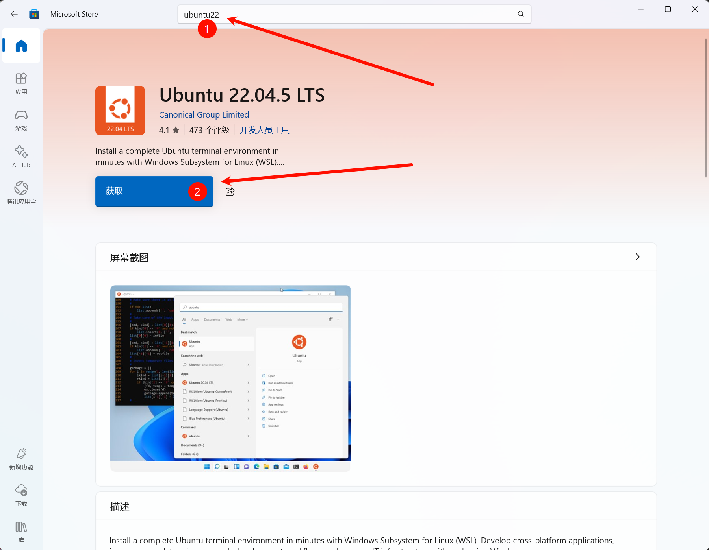
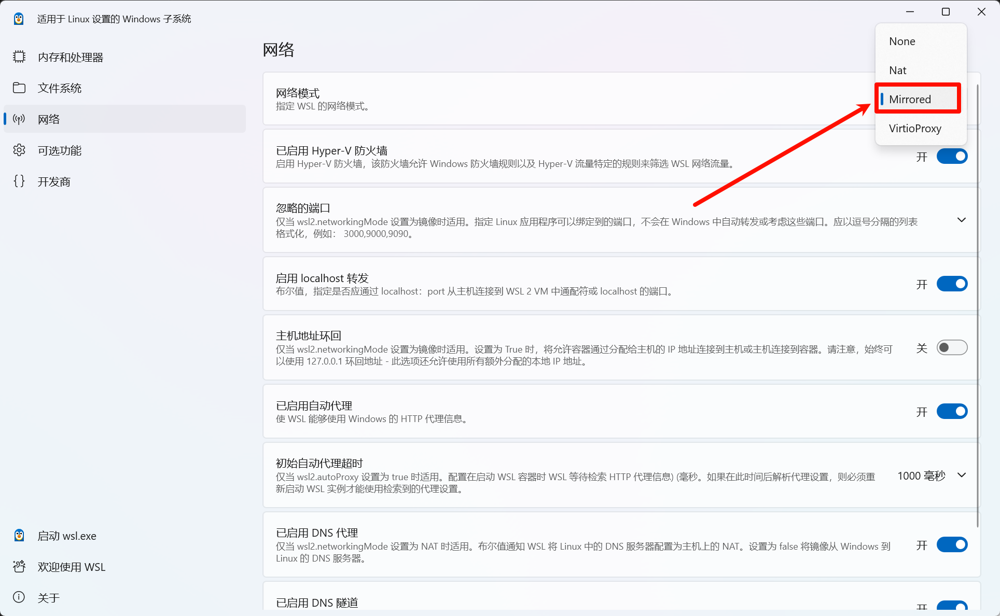

## 打开操控设备

>   多选一

### Ubuntu物理机模式

推荐使用Ubuntu22.04，其他版本要配置python环境

#### 配置 python 环境

>   Ubuntu22.04 不用

1.   **安装编译Python所需的依赖**

     ```bash
     sudo apt update
     sudo apt install -y build-essential libssl-dev zlib1g-dev \
     libncurses5-dev libncursesw5-dev libreadline-dev libsqlite3-dev \
     libgdbm-dev libdb5.3-dev libbz2-dev libexpat1-dev liblzma-dev \
     tk-dev libffi-dev wget curl git
     ```

2.   **安装 pyenv**

     ```bash
     curl https://pyenv.run | bash
     ```

     安装完成后，需要把 pyenv 添加到 shell 配置文件（如 `~/.bashrc` 或 `~/.zshrc`）：

     ```bash
     # 添加到 ~/.bashrc 的底部
     export PATH="$HOME/.pyenv/bin:$PATH" # 把pyenv添加到PATH中
     eval "$(pyenv init --path)"          # 初始化pyenv
     eval "$(pyenv virtualenv-init -)"    # 初始化pyenv的virtualenv插件
     
     # 为 python3 创建别名（可选）
     alias python=python3
     alias pip=pip3
     ```

     然后 **重新加载 shell**，并检查 pyenv 是否安装成功

     ```bash
     source ~/.bashrc
     pyenv --version
     ```

3.    **安装 Python 3.10**

     ```bash
     pyenv update          # 确保 pyenv 使用的是最新的 Python 构建信息
     pyenv install 3.10.19 # 安装 Python 3.10.19
     ```

     >   如果出现 `md5sum mismatch` 或下载错误，可以手动先下载源码，再放到 pyenv 缓存目录：
     >
     >   ```bash
     >   mkdir -p ~/.pyenv/cache
     >   wget https://www.python.org/ftp/python/3.10.19/Python-3.10.19.tgz -O ~/.pyenv/cache/Python-3.10.19.tgz
     >   pyenv install 3.10.19
     >   ```
     >
     >   注：编译一般要2~6分钟，并且没有进度条

4.   **设置全局或本地 Python 版本**

     >   二选一

     ```bash
     # 设置全局默认 Python（系统所有终端生效）
     pyenv global 3.10.19 
     
     # 设置某个项目目录使用（只对当前目录有效）
     cd /path/to/robot-dog
     pyenv local 3.10.19
     ```

     检查 Python 版本

     ```bash
     python --version
     # 或
     python3 --version
     ```

5.    通过虚拟环境来隔离（可选）

     ```bash
     pyenv virtualenv 3.10.19 myenv  # 创建虚拟环境
     pyenv activate myenv            # 启用虚拟环境
     pyenv deactivate                # 退出虚拟环境
     ```

     


### WSL 镜像网络模式

让 **局域网内任意设备**（手机、平板、另一台电脑）通过
`http://Windows局域网IP:端口` 直接访问 **WSL2** 里运行的服务（Flask、Node、Docker、SSH …）。

> 需要win11才可以，win10不支持镜像模式

1. **下载WSL2的Ubuntu22.04**

   >   因为自带python3.10，不用再配环境

   1.   点击开始菜单，搜索 `microsoft store`

   2.   下载 Ubuntu22.04

        

    3.   （可选）切换为默认实例

         >   切换后可以直接输入 `wsl` 打开

         ```bash
         wsl -l -v                      # 查看当前实例（带*的为默认实例）
         wsl --setdefault Ubuntu-22.04 # 设置默认实例为22.04
         wsl -l -v                      # 查看是否设置成功
         
         wsl -d Ubuntu-22.04            # 直接打开22.04
         wsl                            # 打开默认实例
         ```
         
         ​     

2. **切换为镜像网络模式**

   1. 点击开始菜单，搜索 `wsl settings`
   2. 切换镜像网络模式

   > 说明：
   > `mirrored` 模式下，WSL2 拿到的 IP == Windows 局域网 IP，**无需再手动端口转发**。

3. **重启 WSL**

    ```powershell
    wsl --shutdown      # 完全关闭所有子系统
    wsl -d ubuntu-22.04 # 重新进入22.04实例
    ```


#### 虚拟机

1.   改成桥接模式，然后复制物理网络连接状态

2.   然后参考 [Ubuntu物理机模式](###Ubuntu物理机模式)


#### 在Windows的Docker运行

1.   安装[wsl2](###WSL 镜像网络模式)、[vscode](https://code.visualstudio.com/)、[docker](https://github.com/asxez/DockerDesktop-CN/releases/)
2.   [打开开发容器](../.devcontainer/README.md)

