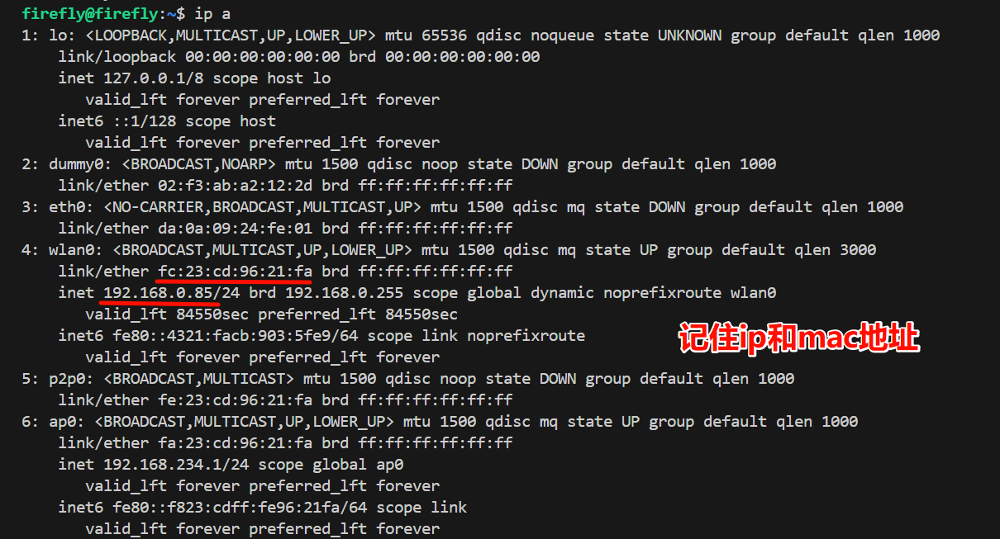
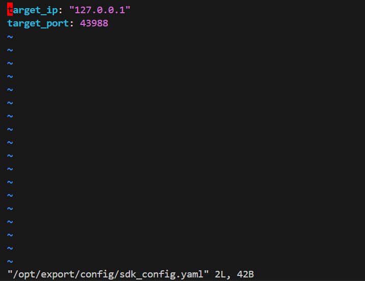
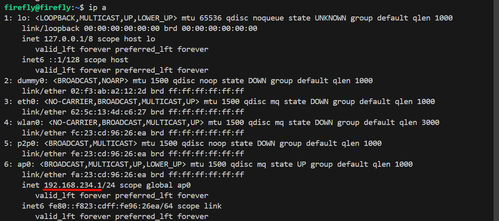

## 连接机器狗

### 配置网络

#### 0. 使用脚本连接

```bash
python3 tools/配置机器狗.py
```

#### 1. AP（热点）直连

1. **找到机械狗遥控器并连接上遥控器上写的机器狗自身的 WIFI**

   > 一般是 agibot001

2. **ssh远程登陆机器狗**
   
    ```bash
    ssh firefly@192.168.234.1  # ip是固定的，用户名和密码默认是：firefly
    ```
3. **查看本地 IP**

     ```bash
    ip a # ip addr
    ```

    

    > 这是机械狗 WIFI 分配给本地的局域网 IP

4. **修改 SDK 配置文件**

   ```bash
   sudo vim /opt/export/config/sdk_config.yaml
   ```

   
   
   ```bash
   > `target_ip` 修改为本地 IP，端口一般不用改
   ```
   
   

#### 2. WIFI 局域网连接

1. **按照 [AP 直连步骤 1、2](####1. AP（热点）直连)，远程登陆**

2. **机械狗连接 WIFI**

   ```bash
   # 查看附近网络
   sudo nmcli device wifi list
   
   # 连接WIFI网络
   sudo nmcli device wifi connect WIFI名称 password WIFI密码 ifname wlan0
   
   # 关闭网络清除服务 (防止每次关机后都清除网络)
   sudo systemctl stop networkmanager-cleanup.service
   sudo systemctl disable networkmanager-cleanup.service
   
   # 开启自动连接
   sudo nmcli connection modify WIFI名称 connection.autoconnect yes
   ```
   
   
   
   记录mac地址和ip地址
   
   
   > 成功连接 WIFI 后，重新通过wifi远程登录，使用上图获取的机械狗在wifi中的 IP（如果不知道需要下载advanced ip scanner等工具扫描局域网 IP（通过mac地址查询））
   
3. **本机连上 WIFI 后，可以使用机械狗局域网 IP 进行 ssh 远程登录**

4. **编辑运控文件，添加变量**

   ```bash
   sudo vim /opt/app_launch/start_motion_control.sh
   ```
   
    在文件 `/opt/app_launch/start_motion_control.sh` 中，于 `export ROBOT_TYPE=xxx` 行之后，新增一行环境变量配置： 

   ```bash
   export SDK_CLIENT_IP='【机械狗局域网IP地址】'
   ```
   
   完整示例（添加后）：
   
   ```bash
   #!/bin/bash
   sleep 10
   echo "start motion control" # 启动运动控制
   
   # 共享内存文件路径
   SHM_FILE="/dev/shm/spline_shm"
   
   # 循环检查设备是否存在
   while true; do
       if [ -e "$SHM_FILE" ]; then
           echo "共享内存文件 $SHM_FILE 已存在。"
           break
       else
           echo "共享内存文件 $SHM_FILE 不存在，等待 1 秒后重试..."
           sleep 1
       fi
   done
   
   # 共享内存文件存在后执行的命令
   echo "共享内存文件已准备好，可以执行后续操作。"
   
   sudo ifconfig lo multicast
   sudo route add -net 224.0.0.0 netmask 240.0.0.0 dev lo
   
   export LD_LIBRARY_PATH=/opt/export/mc/bin
   export ROBOT_TYPE=P2
   export SDK_CLIENT_IP='192.168.1.116'  
   
   cd /opt/export/mc/bin && taskset -c 7 ./mc_ctrl r
   ```
   
   > 注意：直连模式要删除或注释 `SDK_CLIENT_IP`，然后重启运控

5. **参照 [AP 直连步骤 4](####1. AP（热点）直连)，修改 SDK 配置文件**

6. **重启运控**

    ```bash
    robot-launch restart 4
    ```
    
    > 注意：在重启运控之前必须让机械狗先卧倒，否则会急停


## 运行代码

```bash
python3 ./src/python/dance_1dog.py 
```


