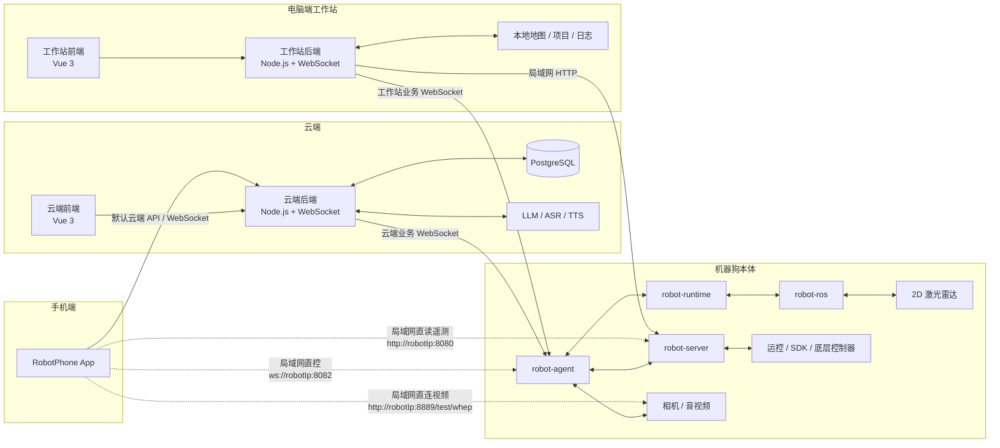
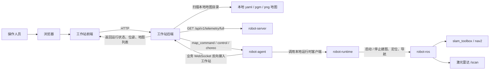
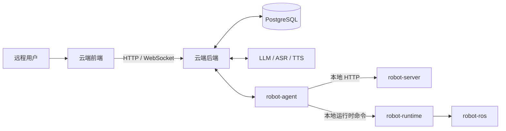
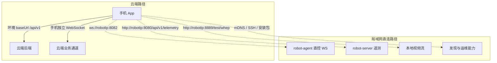
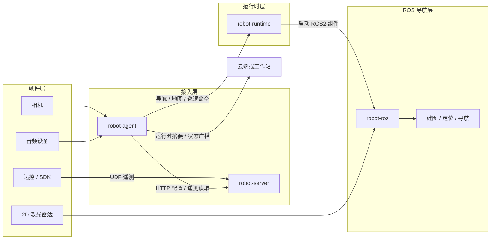
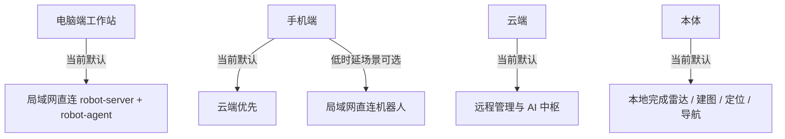

# 全端链路流程图

> 流程图可以用 Typora 查看 GUI

本文把当前仓库里的几个主要端统一整理成 Mermaid 流程图，方便快速理解：

- 手机端 `repos/robot-phone`
- 电脑端工作站 `repos/robot-pc`
- 云端 `repos/robot-cloud`
- 机器狗本体 `repos/robot-onboard`

## 1. 总体拓扑

## 2. 电脑端工作站链路

当前电脑端是本地优先、局域网直连的工作站模式。

### 说明

- 当前电脑端地图工作台主要是“静态地图底图 + 位姿/状态”模式。
- 当前地图工作台默认通过工作站后端读 `robot-server`，并通过工作站业务 WebSocket 与 `robot-agent` 收发命令。
- 当前仓库里已经具备雷达、建图、定位链路，但电脑端地图页还没有把实时 `scan` 或实时栅格图直接推到前端画布。

## 3. 云端链路

云端负责远程接入、账号权限、资产管理，以及 AI 能力接入。

### 说明

- 云端是远程管理中枢，不适合直接承载原始激光雷达数据流。
- 适合放在云端的是账号、角色、编舞项目、机器人资产、远程任务、AI 对话与音频能力。
- 本体的建图、定位、导航、雷达驱动仍应留在本地完成。

## 4. 手机端链路

手机端当前是“云端优先 + 局域网直连能力并存”的模式。

### 说明

- 手机端的数据管理、账号、角色、编舞项目更偏向走云端。
- 手机端为了降低操控延迟，也保留了局域网直控链路。
- 视频、遥测、群控这类对时延敏感的能力，天然更适合局域网直连。

## 5. 本体内部链路

本体内部可以分成“接入层、运行时层、ROS 导航层、硬件层”。

### 分层职责

- `robot-server`：本地 HTTP 服务，负责配置、遥测查询、部分运维接口。
- `robot-agent`：对外通信总入口，负责接云端、接工作站、接手机直控，以及把命令转给本体内部。
- `robot-runtime`：统一导航、地图、任务、状态聚合。
- `robot-ros`：承接雷达驱动、建图、定位、导航等 ROS2 能力。

## 6. 当前默认路径总结

## 7. 常见地址速查

- 工作站业务 WebSocket：`ws://<工作站IP>:<工作站后端端口>/api/v1/web/business?robotId={robotId}&role=robot`
- `robot-server`：`http://<robotIp>:8080`
- 手机直控 WebSocket：`ws://<robotIp>:8082`
- 本地视频 WHEP：`http://<robotIp>:8889/test/whep`

## 8. 后续建议

如果后面要继续补文档，建议按下面顺序细化：

1. 单独补一份“电脑端地图工作台实时绘图链路图”
2. 单独补一份“云端音频 / 对话 / TTS 回路图”
3. 单独补一份“手机端直控与群控链路图”
